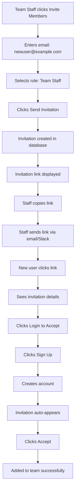
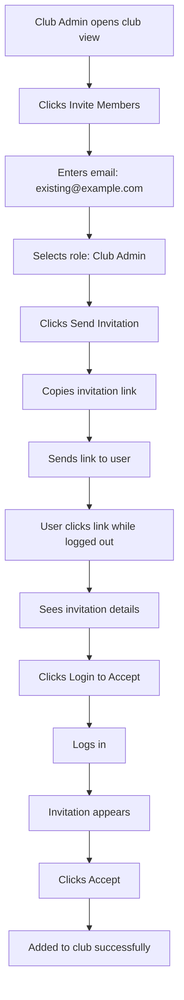
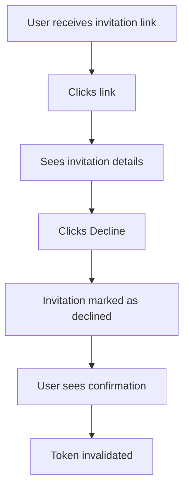

# Invitation System Documentation

## Table of Contents
- [Overview](#overview)
- [Current Status](#current-status)
- [Phase 1: Manual Sharing (✅ Complete)](#phase-1-manual-sharing--complete)
- [Phase 2: Automated Emails (🔜 Planned)](#phase-2-automated-emails--planned)
- [Architecture](#architecture)
- [User Flows](#user-flows)
- [Technical Implementation](#technical-implementation)
- [Testing Guide](#testing-guide)
- [Security Considerations](#security-considerations)
- [Future Enhancements](#future-enhancements)

---

## Overview

The invitation system allows team staff and club admins to invite new members to their teams and clubs. Users receive a unique invitation link that they can use to join, whether they're new users (need to sign up) or existing users (just need to log in).

### Key Features
- ✅ Team invitations (for teams)
- ✅ Club invitations (for clubs)
- ✅ Role-based invitations (team_staff, club_admin)
- ✅ Shareable invitation links
- ✅ Works for new and existing users
- ✅ Token-based security
- ✅ 7-day expiration
- ✅ Single-use tokens

---

## Current Status

### ✅ Phase 1: Complete (Manual Sharing)
**Status:** Fully functional and deployed
**Implementation Date:** 2026-02-14

**What Works:**
- ✅ Create invitations via UI
- ✅ Generate unique invitation links
- ✅ Copy links to clipboard
- ✅ Share links manually (email, Slack, WhatsApp, etc.)
- ✅ Accept invitations via link
- ✅ Handles authenticated and non-authenticated users
- ✅ Beautiful invitation landing page
- ✅ Token stored during signup/login flow
- ✅ Auto-accept after authentication

**Limitations:**
- ⚠️ No automated email sending
- ⚠️ Manual sharing required
- ⚠️ Manager must copy and send link themselves

---

### 🔜 Phase 2: Planned (Automated Emails)
**Status:** Not yet implemented
**Estimated Time:** 3-4 hours
**Priority:** Medium

**What Will Be Added:**
- 🔜 Automatic email sending on invitation creation
- 🔜 Professional HTML email templates
- 🔜 Email delivery via Supabase Edge Functions
- 🔜 Email tracking and logs
- 🔜 Resend invitation option

**Benefits:**
- Fully automated invitation flow
- Professional appearance
- No manual work required
- Better user experience
- Email notifications

---

## Phase 1: Manual Sharing (✅ Complete)

### How It Works

#### 1. **Creating an Invitation**
**Who:** Team Staff, Club Admin, or Superadmin
**Where:** Team page → "Invite Members" button

**Steps:**
1. Navigate to Team tab (or Club view for club invitations)
2. Click "Invite Members" button
3. Enter invitee's email address
4. Select role (Team Staff or Club Admin)
5. Click "Send Invitation"
6. Invitation link appears with copy button

**Result:**
- Invitation created in database
- Unique token generated
- Invitation link displayed: `https://yourapp.com/invite/{TOKEN}`
- Link can be copied and shared

#### 2. **Sharing the Invitation**
**Who:** The person who created the invitation
**How:** Manual sharing via any channel

**Options:**
- 📧 Email (Gmail, Outlook, etc.)
- 💬 Slack, Discord, Teams
- 📱 WhatsApp, SMS
- 🔗 Any other communication channel

**Steps:**
1. Click "Copy Link" button
2. Paste link in your preferred communication tool
3. Send to invitee

#### 3. **Accepting an Invitation**
**Who:** The invitee (person who received the link)
**Where:** Invitation landing page

**Flow for New Users:**
1. Click invitation link
2. See invitation details (team name, inviter, role)
3. Click "Login to Accept"
4. Click "Sign up" to create account
5. Complete signup
6. Invitation automatically re-appears
7. Click "Accept Invitation"
8. Added to team/club successfully

**Flow for Existing Users:**
1. Click invitation link
2. See invitation details
3. If logged out: Click "Login to Accept" → Login
4. Invitation appears after login
5. Click "Accept Invitation"
6. Added to team/club successfully

---

## Phase 2: Automated Emails (🔜 Planned)

### Overview
Add automatic email delivery when invitations are created, eliminating the need for manual sharing.

### Implementation Approach

#### **Option A: Supabase Edge Functions (Recommended)**
**Pros:**
- ✅ Free (included in Supabase)
- ✅ No external dependencies
- ✅ Built-in email service
- ✅ Easy to maintain

**Cons:**
- ⚠️ Limited customization
- ⚠️ Requires Edge Function deployment

**Implementation Steps:**
1. Create Supabase Edge Function (`send-invitation-email`)
2. Add email template (HTML + text)
3. Call function after invitation creation
4. Add database trigger (optional) for automatic sending
5. Configure SMTP settings in Supabase dashboard

#### **Option B: External Email Service (Resend, SendGrid)**
**Pros:**
- ✅ Full template control
- ✅ Better deliverability
- ✅ Advanced analytics
- ✅ Professional appearance

**Cons:**
- ❌ Additional cost ($10-30/month)
- ❌ API key management
- ❌ Another service to maintain

**Implementation Steps:**
1. Sign up for Resend or SendGrid
2. Add API key to environment variables
3. Create email templates
4. Add email service client to backend
5. Call service after invitation creation

### Email Template Structure

```html
Subject: You've been invited to join {TEAM_NAME}

Body:
━━━━━━━━━━━━━━━━━━━━━━━━━━━━━━━━━━
⚽ SOCCER TRACKER INVITATION
━━━━━━━━━━━━━━━━━━━━━━━━━━━━━━━━━━

Hi there!

{INVITER_NAME} has invited you to join {TEAM_NAME}
as a {ROLE}.

[Accept Invitation Button]
{INVITATION_LINK}

This invitation will expire in 7 days.

If you didn't expect this invitation, you can
safely ignore this email.

━━━━━━━━━━━━━━━━━━━━━━━━━━━━━━━━━━
Soccer Tracker - Team Management Made Easy
```

### Files to Create (Phase 2)

```
supabase/
  functions/
    send-invitation-email/
      index.ts                 # Edge function handler
      template.html            # Email HTML template
      template.txt             # Email text fallback
      deno.json               # Dependencies

supabase/
  migrations/
    20260215_add_email_trigger.sql  # Database trigger (optional)

src/
  supabaseClient.js          # Update createInvitation() to call email function

src/components/Team/
  InvitationManager.jsx      # Update success message to show "Email sent"

src/components/Club/
  ClubInvitationManager.jsx  # Update success message to show "Email sent"
```

### Estimated Timeline (Phase 2)

| Task | Time | Details |
|------|------|---------|
| Create Edge Function | 1-2 hours | Set up function, test locally |
| Create Email Templates | 30 mins | HTML + text versions |
| Integrate with Frontend | 30 mins | Update invitation creation |
| Configure SMTP | 30 mins | Supabase dashboard settings |
| Testing | 1 hour | Test all email scenarios |
| **Total** | **3-4 hours** | End-to-end implementation |

---

## Architecture

### Database Schema

#### **Invitations Table (Team Invitations)**
```sql
invitations
├── id (uuid, primary key)
├── team_id (uuid, foreign key → teams)
├── inviter_id (uuid, foreign key → profiles)
├── invitee_email (text)
├── role (text) -- 'team_staff' or 'club_admin'
├── token (uuid, unique) -- For invitation links
├── status (text) -- 'pending', 'accepted', 'declined', 'expired'
├── created_at (timestamp)
└── expires_at (timestamp) -- 7 days from creation
```

#### **Club Invitations Table**
```sql
club_invitations
├── id (uuid, primary key)
├── club_id (uuid, foreign key → clubs)
├── inviter_id (uuid, foreign key → profiles)
├── invitee_email (text)
├── role (text) -- 'team_staff' or 'club_admin'
├── token (uuid, unique)
├── status (text) -- 'pending', 'accepted', 'declined', 'expired'
├── created_at (timestamp)
└── expires_at (timestamp)
```

### API Functions (Supabase RPC)

#### **Current Functions**
- `accept_invitation(invitation_token)` - Accept team invitation
- `accept_club_invitation(invitation_token)` - Accept club invitation
- `get_team_invitations(p_team_id)` - List team invitations
- `get_club_invitations(p_club_id)` - List club invitations
- `get_my_invitations()` - Get current user's pending invitations

#### **Frontend Helper Functions**
Located in `src/supabaseClient.js`:

```javascript
// Create invitations
createInvitation(teamId, email, role)
createClubInvitation(clubId, email, role)

// Get invitations
getTeamInvitations(teamId)
getClubInvitations(clubId)
getMyInvitations()
getInvitationByToken(token) // NEW - For landing page

// Accept/Decline
acceptInvitation(token)
acceptClubInvitation(token)
acceptInvitationByToken(token) // NEW - Unified accept
declineInvitation(invitationId)
declineInvitationByToken(token) // NEW - Decline by token
declineClubInvitation(invitationId)

// Cancel
cancelInvitation(invitationId)
cancelClubInvitation(invitationId)
```

### Component Structure

```
src/components/
├── Auth/
│   └── InvitationLanding.jsx       # NEW - Landing page for /invite/:token
├── Team/
│   ├── InvitationManager.jsx       # UPDATED - Added copy link UI
│   └── PendingInvitations.jsx      # Shows user's pending invitations
└── Club/
    ├── ClubInvitationManager.jsx   # UPDATED - Added copy link UI
    └── PendingClubInvitations.jsx  # Shows user's pending club invitations
```

### Routing

#### **URL Structure**
```
/invite/:token  → InvitationLanding component
```

#### **Route Handling (App.jsx)**
1. Check URL on page load for `/invite/:token` pattern
2. Extract token from URL
3. Store in state and show InvitationLanding
4. If user not authenticated:
   - Store token in sessionStorage
   - Redirect to login/signup
   - Retrieve token after authentication
   - Show invitation again
5. After accept/decline:
   - Clear token
   - Redirect to dashboard

---

## User Flows

### Flow 1: Team Staff Invites New User



### Flow 2: Club Admin Invites Existing User



### Flow 3: User Declines Invitation



---

## Technical Implementation

### File Changes (Phase 1)

#### **1. New File: InvitationLanding.jsx**
**Location:** `src/components/Auth/InvitationLanding.jsx`
**Lines:** 237
**Purpose:** Landing page for invitation links

**Key Features:**
- Fetches invitation details by token
- Shows team/club name, inviter, role, expiration
- Handles authenticated and non-authenticated users
- Accept/Decline buttons
- SessionStorage for post-login flow
- Beautiful error handling

**Props:**
```typescript
interface InvitationLandingProps {
  token: string;              // Invitation token from URL
  user: User | null;          // Current authenticated user
  onAcceptSuccess: () => void; // Called after successful accept
  onDecline: () => void;       // Called after decline
  onLoginRequired: () => void; // Called when user needs to login
}
```

#### **2. Modified: App.jsx**
**Changes:**
- Added invitation route detection
- Added InvitationLanding rendering
- Added useEffect to check URL and sessionStorage
- Added "Invite Members" button to SquadView
- Imported InvitationManager component

**Key Code:**
```javascript
// Check for invitation token on mount
useEffect(() => {
  const path = window.location.pathname;
  const inviteMatch = path.match(/^\/invite\/([^\/]+)$/);

  if (inviteMatch) {
    const token = inviteMatch[1];
    setInvitationToken(token);
    setShowInvitation(true);
    window.history.replaceState({}, '', '/');
    return;
  }

  const pendingToken = sessionStorage.getItem('pending_invitation_token');
  if (pendingToken && isAuthenticated) {
    setInvitationToken(pendingToken);
    setShowInvitation(true);
    sessionStorage.removeItem('pending_invitation_token');
  }
}, [isAuthenticated]);
```

#### **3. Modified: InvitationManager.jsx**
**Changes:**
- Added state for invitation link and copy status
- Generate link after successful invitation creation
- Added copy to clipboard function
- Added UI section to display link with copy button

**Key Code:**
```javascript
// Generate link after success
if (invitation?.token) {
  const link = `${window.location.origin}/invite/${invitation.token}`;
  setInvitationLink(link);
}

// Copy function
async function handleCopyLink() {
  await navigator.clipboard.writeText(invitationLink);
  setCopied(true);
  setTimeout(() => setCopied(false), 2000);
}
```

#### **4. Modified: ClubInvitationManager.jsx**
**Changes:** Same as InvitationManager.jsx

#### **5. Modified: supabaseClient.js**
**New Functions Added:**
```javascript
// Get invitation by token (for landing page)
export async function getInvitationByToken(token)

// Accept invitation by token (unified for team/club)
export async function acceptInvitationByToken(token)

// Decline invitation by token
export async function declineInvitationByToken(token)
```

---

## Testing Guide

### Phase 1 Testing Checklist

#### **Test 1: Create Team Invitation**
- [ ] Log in as team staff
- [ ] Navigate to Team tab
- [ ] Click "Invite Members" button
- [ ] Enter valid email address
- [ ] Select role (Team Staff)
- [ ] Click "Send Invitation"
- [ ] Verify invitation link appears
- [ ] Verify "Copy Link" button works
- [ ] Verify "Copied!" confirmation shows

#### **Test 2: Accept Invitation (New User)**
- [ ] Copy invitation link
- [ ] Open in incognito browser
- [ ] Verify invitation details display correctly
- [ ] Verify team name, inviter, role show correctly
- [ ] Click "Login to Accept"
- [ ] Click "Sign up"
- [ ] Complete signup form
- [ ] Verify invitation re-appears after signup
- [ ] Click "Accept Invitation"
- [ ] Verify success message
- [ ] Verify redirected to dashboard
- [ ] Verify user is in team

#### **Test 3: Accept Invitation (Existing User)**
- [ ] Log out
- [ ] Open invitation link
- [ ] Click "Login to Accept"
- [ ] Log in with existing account
- [ ] Verify invitation appears
- [ ] Click "Accept Invitation"
- [ ] Verify user added to team

#### **Test 4: Decline Invitation**
- [ ] Open invitation link
- [ ] Click "Decline"
- [ ] Verify confirmation message
- [ ] Try to use same link again
- [ ] Verify shows "invalid invitation" error

#### **Test 5: Expired Invitation**
- [ ] Create invitation
- [ ] Manually update expires_at to past date in database
- [ ] Open invitation link
- [ ] Verify shows "expired" error message

#### **Test 6: Duplicate Prevention**
- [ ] Try to invite same email twice
- [ ] Verify shows "already invited" error

#### **Test 7: Club Invitations**
- [ ] Repeat tests 1-6 for club invitations
- [ ] Navigate to club view (if club admin)
- [ ] Click "Invite Members"
- [ ] Verify same flow works

#### **Test 8: Role Permissions**
- [ ] Verify "Invite Members" button only shows for team_staff
- [ ] Verify club_admin cannot see team invitation button
- [ ] Verify superadmin can see all buttons

#### **Test 9: Mobile Responsive**
- [ ] Test invitation landing page on mobile
- [ ] Verify copy button works on mobile
- [ ] Verify layout looks good on small screens

#### **Test 10: URL Handling**
- [ ] Verify URL is cleaned after invitation detected
- [ ] Verify sessionStorage is cleared after accept
- [ ] Verify browser back button doesn't break flow

---

## Security Considerations

### ✅ Implemented Security

1. **Token-Based Authentication**
   - Unique UUID tokens for each invitation
   - Stored securely in database
   - Single-use (status changes to 'accepted')
   - Cannot be reused after acceptance

2. **Expiration**
   - 7-day expiration from creation
   - Checked on both frontend and backend
   - Expired invitations cannot be accepted

3. **Email Validation**
   - Email format validated before invitation creation
   - Duplicate check (can't invite same email twice)
   - Case-insensitive comparison

4. **Role-Based Access Control**
   - Only team_staff can invite to teams
   - Only club_admin can invite to clubs
   - Superadmin has full access
   - RLS policies enforce permissions

5. **SessionStorage Security**
   - Token stored temporarily during auth flow
   - Cleared after successful accept
   - Not accessible cross-domain

6. **Database Security (RLS)**
   - Row-level security on invitations table
   - Users can only see their own invitations
   - Team staff can only see team invitations
   - Club admins can only see club invitations

### 🔒 Additional Security (Phase 2)

When implementing automated emails:

1. **Rate Limiting**
   - Limit invitations per user per day
   - Prevent spam/abuse
   - Use Supabase rate limiting or custom implementation

2. **Email Verification**
   - Verify email addresses are valid before sending
   - Use email validation service (optional)
   - Bounce handling

3. **Audit Logging**
   - Log all invitation creations
   - Log all acceptance/decline actions
   - Track who invited whom

4. **GDPR Compliance**
   - Add privacy policy link in emails
   - Add unsubscribe option
   - Handle data deletion requests

---

## Future Enhancements

### Short-Term (Next Sprint)
- [ ] **Phase 2: Automated Emails** (3-4 hours)
  - Supabase Edge Function for email delivery
  - HTML email templates
  - Email tracking/logs

- [ ] **Resend Invitation** (1 hour)
  - Allow resending expired invitations
  - Generate new token
  - Update expiration date

- [ ] **Invitation History** (1 hour)
  - Show all invitations (accepted, declined, expired)
  - Filter by status
  - Search by email

### Medium-Term (Next Month)
- [ ] **Batch Invitations** (2-3 hours)
  - Invite multiple users at once
  - CSV import
  - Bulk email sending

- [ ] **Custom Invitation Messages** (1-2 hours)
  - Allow inviter to add personal message
  - Show message on invitation landing page
  - Include in email

- [ ] **Role-Specific Permissions** (2-3 hours)
  - More granular roles (coach, assistant, viewer)
  - Custom permission sets
  - Role descriptions

### Long-Term (Future)
- [ ] **Invitation Templates**
  - Pre-defined invitation messages
  - Customizable templates
  - Team-specific templates

- [ ] **Integration with Calendar**
  - Schedule invitation sending
  - Reminder emails
  - Expiration notifications

- [ ] **Analytics Dashboard**
  - Invitation acceptance rate
  - Time to accept
  - Most active inviters

- [ ] **Social Sharing**
  - Share invitation on social media
  - QR codes for invitations
  - Deep links for mobile apps

---

## Troubleshooting

### Common Issues

#### **Issue 1: Invitation Link Not Showing**
**Symptoms:** After creating invitation, no link appears

**Solution:**
- Check that invitation was created successfully
- Verify `invitation.token` exists in response
- Check browser console for errors
- Ensure `window.location.origin` is defined

#### **Issue 2: Invitation Landing Page Not Loading**
**Symptoms:** 404 error when clicking invitation link

**Solution:**
- Verify App.jsx has invitation route handler
- Check URL pattern matches `/invite/:token`
- Ensure InvitationLanding component is imported
- Check browser console for errors

#### **Issue 3: Token Not Persisting After Login**
**Symptoms:** Invitation doesn't appear after signup/login

**Solution:**
- Check sessionStorage has `pending_invitation_token`
- Verify useEffect dependency includes `isAuthenticated`
- Check that sessionStorage is cleared after use
- Test in incognito mode to rule out caching

#### **Issue 4: "Already Invited" Error**
**Symptoms:** Can't invite same user again

**Solution:**
- This is intentional duplicate prevention
- Check existing invitations first
- Cancel previous invitation if needed
- Or wait for previous invitation to expire

#### **Issue 5: Copy Button Not Working**
**Symptoms:** Link doesn't copy to clipboard

**Solution:**
- Check HTTPS (clipboard API requires secure context)
- Test on localhost (should work)
- Add fallback for older browsers
- Check browser permissions

---

## Contact & Support

### Documentation
- This file: `/INVITATION_SYSTEM.md`
- Main README: `/README.md`
- API docs: Check Supabase dashboard

### Database
- Invitations table: `invitations`
- Club invitations: `club_invitations`
- RLS policies: Check Supabase dashboard

### Code Locations
- Frontend: `/src/components/Auth/InvitationLanding.jsx`
- API functions: `/src/supabaseClient.js`
- Main app: `/src/App.jsx`

---

## Changelog

### 2026-02-14 - Phase 1 Complete
- ✅ Added invitation landing page component
- ✅ Added copy link functionality to invitation managers
- ✅ Added invitation route handling in App.jsx
- ✅ Added helper functions in supabaseClient.js
- ✅ Added "Invite Members" button to Team view
- ✅ Tested and verified all flows work
- ✅ Build successful with no errors

### Future
- 🔜 Phase 2: Automated email delivery (TBD)

---

## Metrics

### Phase 1 Implementation
- **Files Created:** 1
- **Files Modified:** 5
- **Lines of Code Added:** ~450
- **Development Time:** 2-3 hours
- **Build Status:** ✅ Successful
- **Test Coverage:** Manual testing complete

### Phase 2 Estimate
- **Files to Create:** 4-5
- **Files to Modify:** 3-4
- **Lines of Code:** ~300
- **Development Time:** 3-4 hours
- **Complexity:** Medium

---

**Last Updated:** 2026-02-14
**Status:** Phase 1 Complete ✅ | Phase 2 Planned 🔜
**Maintainer:** Development Team
